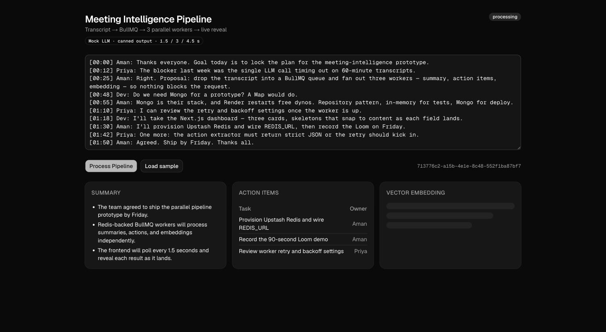

# Parallelized Meeting Intelligence Pipeline

Drop a meeting transcript into a BullMQ queue; three workers independently produce a summary, action items, and a vector embedding; the UI polls and reveals each result as it lands.

## Quick start — for the interviewer

Everything below needs only Docker Desktop (and `git`). Each line is one command.

    git clone https://github.com/amannarayanshukla/meeting-intelligence-pipeline && cd meeting-intelligence-pipeline
    ./demo.sh                          # builds 4 containers, picks free ports, opens the UI → click "Load sample" → "Process Pipeline"
    docker compose logs -f api | grep -E '▶|✔'   # (2nd terminal) watch the three jobs start in the same second and finish at 1.5 / 3 / 4.5 s
    ./demo.sh load                     # 100 concurrent submits (300 jobs): API accepts all in ~200 ms, queue drains in ~5 min at WORKER_CONCURRENCY=3
    WORKER_CONCURRENCY=30 ./demo.sh && ./demo.sh load   # same burst, 10× the workers → drains in ~30 s. That's the bottleneck, and the knob.
    docker compose down                # stop everything


Step-by-step, host-side dev, the 90-second demo script and troubleshooting: [docs/PLAYBOOK.md](docs/PLAYBOOK.md).

## Links (fill after deploy)

- Live UI: <vercel-url>
- API: <render-url>/api/meetings
- 90-second demo: <loom-url>

## Why this shape

- `POST /api/meetings` returns `202 { id }` in milliseconds — no LLM call on the request path.
- One BullMQ queue, one worker with `concurrency: 3`, three jobs per meeting (`summarize`, `extract_actions`, `vectorize`). Job payload is just `{ meetingId }`; the worker reloads the transcript so a 60-minute transcript never sits in Redis three times.
- `jobId = ${meetingId}-${kind}` — a retried enqueue for the same meeting can't double-process (each submit is a new meeting id, so re-submitting a transcript intentionally reprocesses it).
- `status` is derived at read time: `processing` until every kind has settled (field filled or `errors[kind]` set); then `failed` if any error, else `done`. No counter, no "all done" race.
- Each worker writes only its own field with a per-field `$set` (`errors.<kind>` as a dotted path), so three concurrent writers never clobber each other — no transaction, no counter.
- Patterns: Strategy (processors), Repository (InMemory for tests / Mongo for deploy), Adapter (`LlmClient` → `MockLlmClient`; a Gemini client is one file away), Nest DI multi-provider (add a fourth processor with one class + one provider line).

## Run everything with Docker

    docker compose up --build            # UI http://localhost:3000, API http://localhost:3001

Four containers: `web` (Next standalone), `api` (NestJS API + BullMQ worker), `redis` (noeviction, as BullMQ requires), `mongo`. Host ports clash? `WEB_PORT=3005 API_PORT=3002 REDIS_PORT=6380 docker compose up --build`. Note `NEXT_PUBLIC_API_URL` is baked into the web image at build time (Next inlines `NEXT_PUBLIC_*` into the browser bundle), which is why it's a build arg keyed off `API_PORT`.

## Run locally

Three separate terminals, all from the repo root:

    docker compose up -d                              # Redis + Mongo

In a second terminal:

    cd api && cp .env.example .env && npm i && npm run start:dev

In a third terminal:

    cd web && cp .env.example .env.local && npm i && npm run dev   # http://localhost:3000

The API defaults to port 3001 and the web app to 3000, both overridable (`PORT` for the API, `next dev -p <port>` for the web app).

## Tests

Both `api` and `web` run their tests on Vitest.

    cd api && npm test && npm run test:e2e
    cd web && npm test

## Proof it's parallel



```
 web (Next.js, Vercel)                       api (NestJS, Render — API + worker in ONE process)
 ┌─────────────────────┐   POST /api/meetings    ┌──────────────┐  create   ┌───────┐
 │ textarea + Process  │ ───────────────────────▶│ Controller   │──────────▶│ Mongo │
 │                     │ ◀── 202 { id } ─────────│  → Service   │──add×3──┐ └───────┘
 │ 3 cards (skeleton → │                         └──────────────┘         ▼      ▲
 │  content as each    │   GET /api/meetings/:id ┌──────────────┐    ┌─────────┐ │ patch(field)
 │  field arrives)     │ ◀─ poll 1.5s ──────────▶│ Controller   │    │  Redis  │ │
 └─────────────────────┘                         └──────────────┘    │ BullMQ  │ │
                                                                     │"meetings"│ │
                                            ┌────────────────────────┴─────────┴─┘
                                            ▼  MeetingWorker (concurrency 3)
                                   job.name ──▶ Strategy lookup ──▶ Processor.process(transcript)
                                                                          │
                                                                    LlmClient (Mock now, Gemini later)
```

A real run against a live worker, three jobs enqueued for one meeting:

```
[Nest] 79716  - 30/08/2026, 9:11:54 am     LOG [MeetingWorker] ▶ summarize       start  meeting=9ef39835-be40-4704-bf89-11c80111343a
[Nest] 79716  - 30/08/2026, 9:11:54 am     LOG [MeetingWorker] ▶ extract_actions start  meeting=9ef39835-be40-4704-bf89-11c80111343a
[Nest] 79716  - 30/08/2026, 9:11:54 am     LOG [MeetingWorker] ▶ vectorize       start  meeting=9ef39835-be40-4704-bf89-11c80111343a
[Nest] 79716  - 30/08/2026, 9:11:56 am     LOG [MeetingWorker] ✔ summarize       done   meeting=9ef39835-be40-4704-bf89-11c80111343a
[Nest] 79716  - 30/08/2026, 9:11:57 am     LOG [MeetingWorker] ✔ extract_actions done   meeting=9ef39835-be40-4704-bf89-11c80111343a
[Nest] 79716  - 30/08/2026, 9:11:59 am     LOG [MeetingWorker] ✔ vectorize       done   meeting=9ef39835-be40-4704-bf89-11c80111343a
```

Wall clock is max(1.5, 3, 4.5) s, not the 9 s sum.

## What breaks first (load test)

`./demo.sh load` (or `node scripts/load.mjs --n 100 --api http://localhost:3001`) fires 100 concurrent submits (300 jobs), then polls every second until all settle. Two runs on a laptop against the Docker stack, mock LLM delays 1.5 / 3 / 4.5 s:

| `WORKER_CONCURRENCY` | 100 POSTs accepted in | POST p50 / p95 | 300 jobs drained in | jobs/s | status GETs while draining |
|---|---|---|---|---|---|
| 3 (default) | 197 ms | 126 / 171 ms | **303 s** | 0.99 | 49 /s |
| 30 | 272 ms | 177 / 245 ms | **33 s** | 9.04 | 53 /s |

- **The request path doesn't care.** Both bursts are fully accepted in ~200–270 ms; the queue absorbs the work. A blocking design would have held 100 connections open for 4.5 s each.
- **The bottleneck is worker concurrency, and it's a knob.** 10× the concurrency drained 9× faster (ceiling is `concurrency / avg job time` = 1.0 and 10 jobs/s). Past one process, scale by adding worker processes — the API and worker are already separable (`// ponytail:` in `meetings.module.ts`).
- **Polling is the next cost.** 100 open dashboards ≈ 50 status GETs/s on MongoDB regardless of the knob — that is the number behind the `// ponytail: SSE when poll traffic matters` comment in `useMeetingStatus.ts`.

<details>
<summary>Raw output of the two runs</summary>

    $ WORKER_CONCURRENCY=3  ./demo.sh && ./demo.sh load
    submit  100 concurrent POSTs in 197 ms — p50 125.9 ms · p95 170.9 ms · max 173.2 ms
    drain   300 jobs in 303.2 s → 0.99 jobs/s · 14881 status GETs (49.1/s) · failed 0

    $ WORKER_CONCURRENCY=30 ./demo.sh && ./demo.sh load
    submit  100 concurrent POSTs in 272 ms — p50 177.4 ms · p95 244.6 ms · max 247.3 ms
    drain   300 jobs in 33.2 s → 9.04 jobs/s · 1754 status GETs (52.9/s) · failed 0

</details>

Numbers are synthetic (fixed mock delays) — the shape is the point, not the magnitude. Run it locally only: against a free-tier hosted Redis, 300 jobs of BullMQ polling eats a visible slice of the monthly command quota.

## Deploy (author's path — the interviewer needs only Docker)

- **API + Redis on Render:** [one click](https://render.com/deploy?repo=https://github.com/amannarayanshukla/meeting-intelligence-pipeline) via `render.yaml`; you're prompted for a MongoDB Atlas `MONGO_URL` (free M0, allow `0.0.0.0/0`).
- **UI on Vercel:** [one click](https://vercel.com/new/clone?repository-url=https%3A%2F%2Fgithub.com%2Famannarayanshukla%2Fmeeting-intelligence-pipeline&root-directory=web&env=NEXT_PUBLIC_API_URL&envDescription=Base%20URL%20of%20the%20Render%20API%20service&project-name=meeting-intelligence-pipeline); set `NEXT_PUBLIC_API_URL` to the Render URL, then set `CORS_ORIGIN` on Render to the Vercel domain.
- Gotchas (Render must build with `npm ci --include=dev`; Vercel bakes `NEXT_PUBLIC_*` at build time) and the manual dashboard settings: [docs/PLAYBOOK.md §4](docs/PLAYBOOK.md#4-deploy).

## Design

See [`docs/superpowers/specs/2026-08-30-meeting-pipeline-design.md`](docs/superpowers/specs/2026-08-30-meeting-pipeline-design.md) for the decisions table, tradeoffs, and the ceilings each `// ponytail:` comment names.

## Known limits — and why

Every one of these is a decision, not an oversight; the code marks each with a `// ponytail:` comment naming the ceiling (`grep -rn 'ponytail:' api/src web/src`). Columns: what's limited · why it was chosen · what to do when it bites.

| Limit | Why | When it bites → next step |
|---|---|---|
| LLM is a mock: canned text, fixed 1.5 / 3 / 4.5 s delays | No API key, and the architecture — not prompt quality — is the point; fixed delays make the parallel reveal visible | Real output needed → `GeminiLlmClient` behind the `LlmClient` adapter: one file plus one provider line in `llm.module.ts` |
| API and worker run in one process | One deployable, one `node dist/main` | Worker load hurts API latency, or workers must scale alone → second entrypoint importing `MeetingsModule` without the controller, then N worker processes |
| One queue for three job kinds | They share retry/backoff/concurrency today | A kind needs its own policy (embeddings hitting a provider rate limit) → per-kind queues, same processors |
| Create-then-enqueue is not atomic | Two systems, no distributed transaction; a Redis blip mid-enqueue leaves an orphan `processing` doc — but the client got a 500 and never sees the id | Orphans matter → outbox table, or enqueue first and create the doc from the first worker |
| UI polls every 1.5 s | Simplest transport; stops on settle | ~50 GET/s per 100 open dashboards (measured above) → SSE endpoint fed by BullMQ `completed`/`failed` events |
| `status` turns `failed` only after all three kinds settle | No counter, no race; each card shows its own error immediately | Need a fast red badge → emit `failed` on first error, keep polling until settle |
| Hook retries fetch errors forever | A deploy blip or CORS typo shouldn't kill the session | A deleted meeting spins the UI → cap consecutive failures and surface it |
| No auth, no rate limit, `CORS_ORIGIN=*` by default | Prototype; nothing to protect | Public URL for real → API key/JWT, `@nestjs/throttler`, tighten CORS |
| Meetings are never deleted; jobs pruned after 1 h (ok) / 24 h (failed) | Retention is a product decision | Mongo grows → TTL index on `createdAt` |
| 1 MB body, 200 000-char transcript, one job per kind | A 60-minute transcript fits; each worker reads it once from Mongo (payload is only the id) | Multi-hour transcripts or model context limits → chunk inside the processor (map-reduce summary) |
| Embedding is 768 deterministic floats, no vector index | Shows the third parallel branch without an embeddings provider | Semantic search → real embeddings + Atlas Vector Search / Elasticsearch `dense_vector` |
| Mongo repository verified live, not unit-tested | `InMemoryMeetingRepository` pins the contract; Mongo needs a server | CI must prove both impls → `describe.each([InMemory, Mongo])` contract suite gated on `MONGO_URL` |
| No health endpoint, no metrics | Logs already show the parallelism | Production → `GET /api/health`, queue depth/age from `queue.getJobCounts()`, OpenTelemetry |
| Load numbers are synthetic | Fixed mock delays on a laptop; the *shape* — flat acceptance, knob-bound drain — is what's real | Real provider → re-run; expect provider rate limits, not CPU, to be the first wall |
